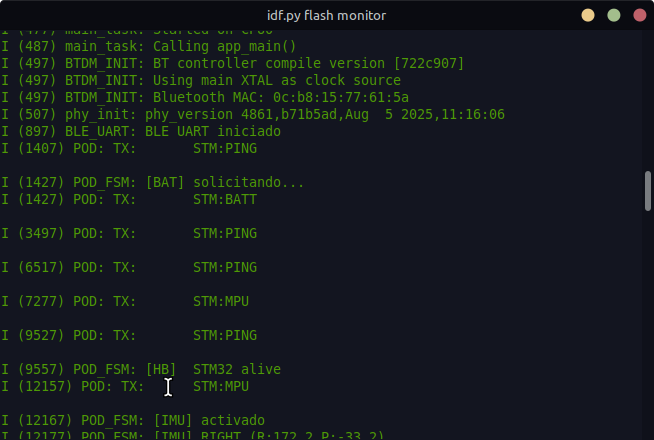
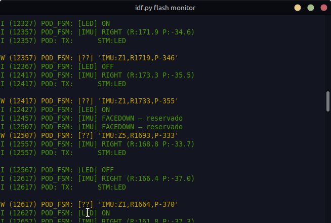
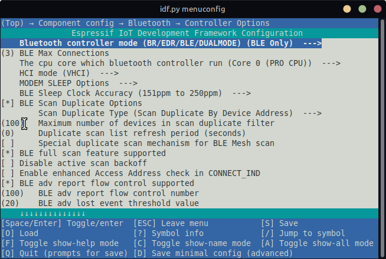
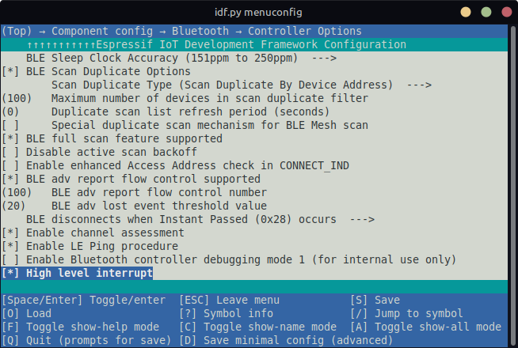

# POD-042 — ESP32 Firmware  
   
Central processing unit of the POD-042 system, implemented on an ESP32 DevKit V1.  
Responsible for BLE telemetry, STM32 communication, and system state management.  
   
   
## Hardware Requirements  
   
| Component | Description |  
|-----------|-------------|  
| ESP32 DevKit V1 | Main microcontroller |  
| STM32 (see stm32 branch) | Peripheral control unit |  
   
### Pin Configuration  
   
| Pin | Function |  
|-----|----------|  
| GPIO 16 | UART RX — receives data from STM32 |  
| GPIO 17 | UART TX — sends commands to STM32 |  
| GPIO 4  | Physical button — IMU toggle / wake signal |  
   
---  
   
## Dependencies  
   
- **ESP-IDF v5.5.1** — Espressif IoT Development Framework  
- **esp_hid** — HID/GATT BLE component (included in ESP-IDF)  
- **nvs_flash** — Non-volatile storage for BLE bonding  
   
---  
   
## FSM States  
   
| State | Description |  
|-------|-------------|  
| `ESP_STATE_INIT` | System initialization, first ping to STM32 |  
| `ESP_STATE_IDLE` | Heartbeat every 3s, battery request every 30s |  
| `ESP_STATE_IMU_ACTIVE` | IMU data processing, BLE telemetry transmission |  
| `ESP_STATE_ERROR` | Communication fault, retry logic |  
   
---  
   
## STM32 Communication Protocol  
   
UART2 at 115200 baud, 8N1.  
   
### Commands sent to STM32  
   
| Command | Description |  
|---------|-------------|  
| `STM:PING\n` | Heartbeat request |  
| `STM:BATT\n` | Battery level request |  
| `STM:LED\n` | LED toggle request |  
| `STM:MPU\n` | IMU enable/disable toggle |  
   
### Messages received from STM32  
   
| Message | Description |  
|---------|-------------|  
| `ESP:PING:RECEIVE` | Heartbeat acknowledge |  
| `ESP:LED:ON/OFF` | LED state confirmation |  
| `ESP:ADC:BATT` | Battery measurement response |  
| `IMU:ON / IMU:OFF` | IMU activation state |  
| `IMU:SHAKE` | Shake gesture detected |  
| `IMU:Z%d,R%d,P%d` | Zone, roll x10, pitch x10 |  
   
---  
   
## BLE Telemetry  
   
Device name: **POD-9S**    
Profile: GATT NUS (Nordic UART Service)    
Compatible app: **Serial Bluetooth Terminal** (Android)  
   
### Custom profile configuration  
   
| Field | UUID |  
|-------|------|  
| Service UUID | `FFF0` |  
| Read characteristic | `FFF1` |  
| Write characteristic | `FFF2` |  
   
### Telemetry messages  
   
  
  
   
---  
   
## Build and Flash  
   
```bash  
# Set up ESP-IDF environment  
. $HOME/esp/esp-idf/export.sh  
   
# Build  
idf.py build  
   
# Flash and monitor  
idf.py flash monitor  
```  
   
---  
   
## menuconfig Requirements  
   
  
  
   
---  
   
> ⚠️ Work in progress — active development.  
   
